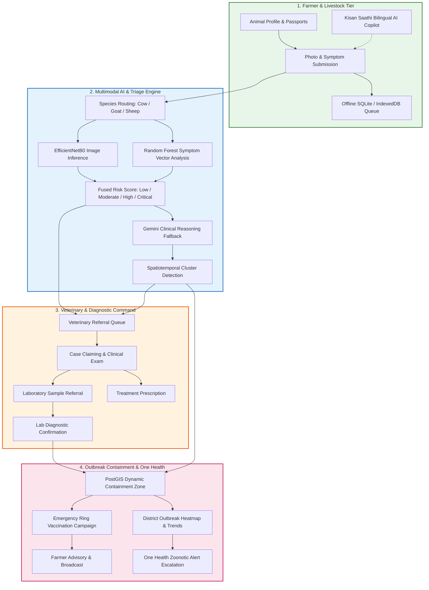
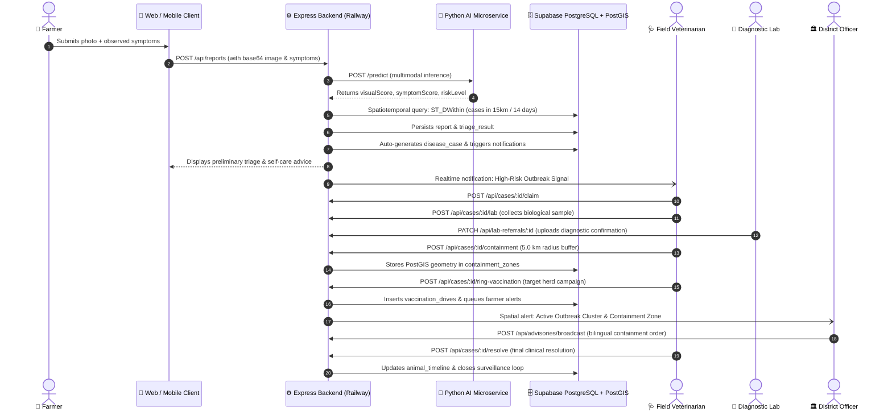
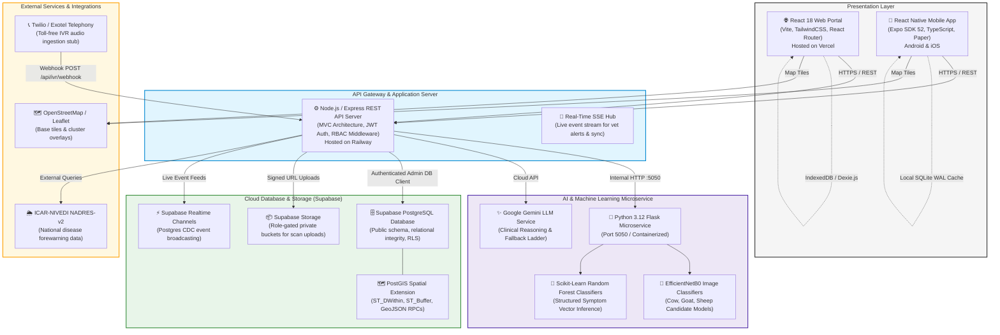
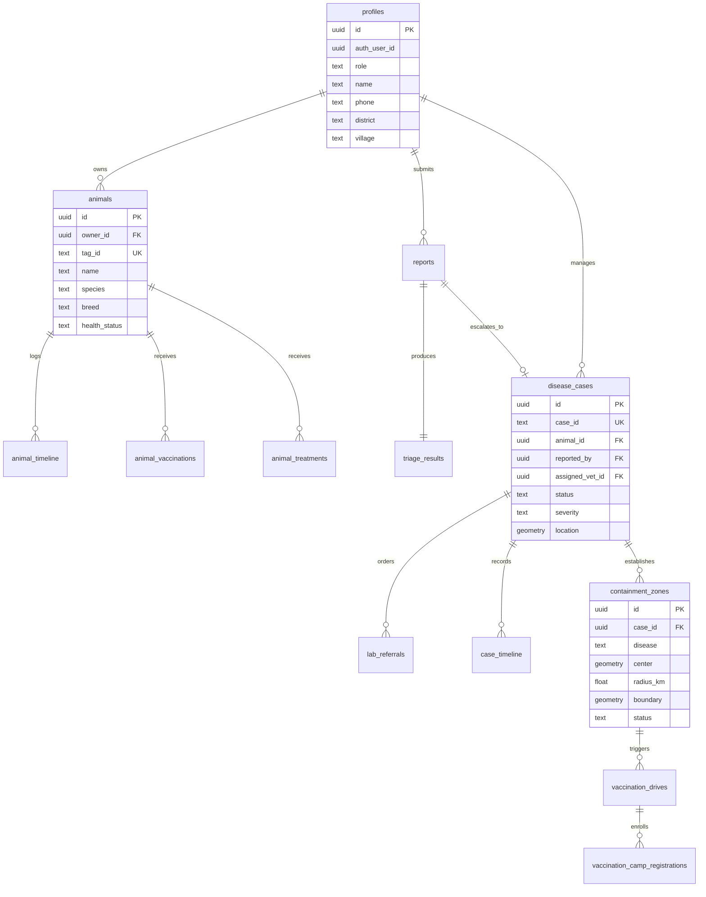
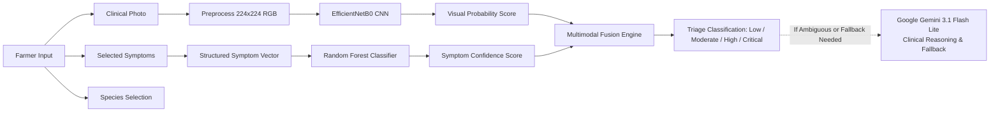
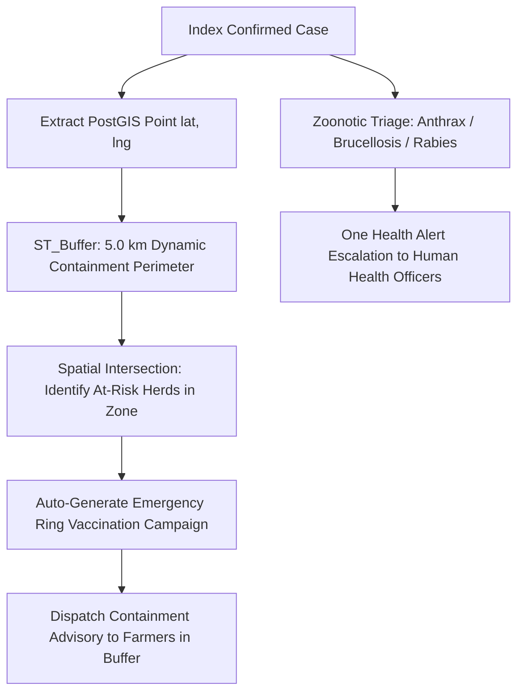

# 🐄 PashuCare (पशुरक्षक)
### AI-Powered Livestock Disease Early Warning & One Health Surveillance Platform

> **Smart Livestock Health & Early Warning Platform**
> *Smart India Hackathon (SIH) — Problem Statement 128*

[](https://www.sih.gov.in/)
[](https://sih-livestock-health-sigma.vercel.app)
[](https://sih-livestock-health-production.up.railway.app/health)
[](mobile/)
[](https://supabase.com/)
[](ml/)

---

## 📌 Executive Summary

**PashuCare** is a production-grade digital ecosystem engineered to bridge the operational gap between rural livestock farmers, field veterinarians, diagnostic laboratories, and district animal husbandry authorities. Built specifically for rural Indian livestock environments, the platform transforms veterinary healthcare from **reactive, late-stage crisis response** into **proactive, AI-assisted early warning, spatial containment, and epidemiological surveillance**.

Rather than stopping at isolated disease classification, PashuCare manages the **complete lifecycle** of livestock disease events: from initial photo/symptom capture and multimodal triage, to real-time veterinary assignment, diagnostic laboratory verification, PostGIS containment zones, targeted ring vaccination campaigns, and state-level epidemiological surveillance.

---

## 🌐 Live Production Deployments

* **Web Portal (Farmers, Vets, Officers)**: [https://sih-livestock-health-sigma.vercel.app](https://sih-livestock-health-sigma.vercel.app)
* **Backend API Gateway & Health Probe**: [https://sih-livestock-health-production.up.railway.app/health](https://sih-livestock-health-production.up.railway.app/health)
* **Mobile Client**: React Native application built on Expo SDK 52 supporting Android and iOS.

---

## 📑 Table of Contents

- [The Operational Challenge](#-the-operational-challenge)
- [The PashuCare Solution](#-the-pashucare-solution)
- [End-to-End Workflow](#-end-to-end-clinical--containment-workflow)
- [User Roles & Portals](#-user-roles--portals)
- [System Architecture](#-system-architecture)
- [Technology Stack](#-technology-stack)
- [Feature Deep Dive](#-feature-deep-dive)
- [Repository Structure](#-repository-structure)
- [Database Architecture](#-database-architecture-supabase--postgis)
- [REST API Reference](#-rest-api-reference)
- [Security & Data Protection](#-security--data-protection)
- [Offline & Low-Connectivity Resilience](#-offline--low-connectivity-resilience)
- [AI Engine & Model Architecture](#-ai-engine--multimodal-architecture)
- [GIS & One Health Epidemiological Surveillance](#-gis--one-health-epidemiological-surveillance)
- [Deployment Topology](#-deployment-topology)
- [Getting Started & Local Setup](#-getting-started--local-setup)
- [Environment Variables](#-environment-variables)
- [Testing & Quality Assurance](#-testing--quality-assurance)
- [Demo Evaluation Personas](#-demo-evaluation-personas)
- [Project Roadmap](#-project-roadmap)
- [Clinical Decision-Support Disclaimer](#-clinical-decision-support-disclaimer)

---

## 🚨 The Operational Challenge

India possesses the world's largest livestock population, supporting over 20.5 million rural livelihoods. However, the animal health surveillance infrastructure faces systemic operational challenges:

1. **Diagnostic & Reporting Lag**: Farmers often identify infectious diseases (e.g., Lumpy Skin Disease, Foot & Mouth Disease, Anthrax) late in progression, delaying intervention until entire herds are infected.
2. **Severe Field Veterinarian Shortage**: In many rural blocks, veterinarian-to-livestock ratios exceed 1:5,000+, leaving remote hamlets without rapid clinical access.
3. **Fragmented Livestock History**: Paper-based or non-existent animal records lead to missed vaccination boosters, unknown treatment histories, and antibiotic misuse.
4. **Delayed Laboratory Synchronization**: Diagnostic sample tracking between field dispensaries and district laboratories is largely manual, causing critical containment delays.
5. **Absence of Spatiotemporal Outbreak Intelligence**: State departments lack automated, real-time spatial aggregation to detect localized disease clusters before they escalate into regional epidemics.
6. **Rural Connectivity Gaps**: Agricultural belts frequently suffer from intermittent connectivity, causing conventional web portals to fail during emergency reporting.
7. **Zoonotic Spillover Vulnerability**: High-consequence zoonoses (Anthrax, Brucellosis, Rabies) lack integrated One Health surveillance channels linking veterinary alerts to public health authorities.

---

## 💡 The PashuCare Solution

PashuCare resolves these bottlenecks through a synchronized **four-pillar ecosystem**:



---

## 🔄 End-to-End Clinical & Containment Workflow



---

## 👥 User Roles & Portals

PashuCare enforces strict Role-Based Access Control (RBAC) across dedicated web and mobile interfaces:

| Role | Target Users | Key Capabilities & Implemented Modules |
| :--- | :--- | :--- |
| **🌾 Farmer** | Livestock Owners, Dairy Farmers, Pastoralists | • Digital animal registration & unique tag ID passports.<br>• Photo & symptom disease reporting with instant preliminary triage.<br>• **Kisan Saathi**: Multilingual conversational copilot with local animal context.<br>• Emergency 1-tap SOS connecting to the 1962 national toll-free helpline.<br>• Offline report submission with automatic background syncing upon reconnect.<br>• Herd vaccination calendars & preventive advisory tracking. |
| **🩺 Veterinarian** | Government Field Vets, Veterinary Officers, Para-Vets | • **Veterinary Command Center**: Real-time referral queue sorted by urgency.<br>• Case claiming, clinical examination notes, and digital prescriptions.<br>• Diagnostic laboratory sample referral creation & specimen result tracking.<br>• GPS containment zone generation and automated ring vaccination campaigns.<br>• Case resolution lifecycle (Suspected $\rightarrow$ Investigating $\rightarrow$ Confirmed $\rightarrow$ Resolved). |
| **🔬 Diagnostic Laboratory** | Disease Investigation Labs (ADIL), Regional Laboratories | • Digital specimen accessioning linked to field referral cases.<br>• Test type tracking (PCR, ELISA, Microscopy, Bacterial Culture).<br>• Status progression (Sample Collected $\rightarrow$ In Transit $\rightarrow$ Processing $\rightarrow$ Completed).<br>• Formal diagnostic result submission with pathogen confirmation. |
| **🏛️ District Officer** | District Animal Husbandry Officers (DAHO), State Epidemiologists | • **Epidemiological Surveillance Dashboard**: Real-time district disease burden.<br>• 30-day temporal epidemic curve analysis & disease breakdown charts.<br>• PostGIS interactive outbreak mapping with active containment zones.<br>• District-wide vaccination campaign monitoring and coverage KPI metrics.<br>• Bilingual emergency advisory broadcast engine (App / SMS alerts).<br>• **One Health Zoonotic Escalation**: Priority monitoring for animal-to-human transmissible pathogens. |

---

## 🏛️ System Architecture

PashuCare uses an isolated, multi-tiered architecture designed for high availability:



---

## 💻 Technology Stack

| Layer | Component | Version / Library | Purpose in PashuCare |
| :--- | :--- | :--- | :--- |
| **Web Frontend** | Framework | `React 18.3` | High-performance, declarative single-page application |
| | Build Tool | `Vite 5.2` | Sub-second HMR and optimized production bundling |
| | Styling | `Tailwind CSS 3.4` | Responsive design system with rural contrast tokens |
| | Mapping | `Leaflet 1.9` / `React-Leaflet 4.2` | Interactive geospatial outbreak layers, pins, and buffer circles |
| | Data Visualization| `Recharts 2.12` | 30-day temporal epidemic trends, case escalation funnels |
| | Internationalization| `i18next 23.11` | Runtime language switching (English, Hindi, Marathi) |
| | Offline Storage | `Dexie.js 4.0` | Browser IndexedDB offline case report queueing |
| **Mobile Client** | Framework | `React Native 0.76` | Cross-platform native mobile application |
| | Application Runtime| `Expo SDK 52` | Universal app platform, managed native modules, file system |
| | Language | `TypeScript 5.3` | Strict type safety across mobile navigation, models, and services |
| | Offline Storage | `Expo SQLite 15.1` | Embedded SQLite WAL-mode local database and sync queue |
| | Network Monitoring| `@react-native-community/netinfo 11.4` | Real-time network transition detection and auto-sync triggers |
| | Secure Storage | `Expo SecureStore 14.0` | Encrypted keychain/keystore token and session persistence |
| **Backend API** | Server Runtime | `Node.js 18+ / 20 LTS` | Event-driven, asynchronous enterprise API execution |
| | Framework | `Express 4.19` | RESTful routing, middleware pipelines, error handling |
| | Client Libraries | `@supabase/supabase-js 2.116` | PostgreSQL queries, PostGIS RPC calls, and Storage operations |
| | Security | `bcryptjs 2.4`, `jsonwebtoken 9.0` | Salting, password hashing, and signed stateless JWT validation |
| **Database & GIS**| Primary Database | `Supabase PostgreSQL 15` | Relational storage for profiles, animals, cases, and drives |
| | Spatial Extension | `PostGIS` | Geographic calculations (`ST_DWithin`, `ST_Point`, `ST_Buffer`) |
| | Cloud Storage | `Supabase Storage` | Private, authenticated bucket storage for clinical animal imagery |
| | Realtime Engine | `Supabase Realtime` | Postgres change data capture (CDC) WebSocket streams |
| **Machine Learning**| Core Framework | `TensorFlow 2.21` / `Keras 3.15` | Deep convolutional neural network execution |
| | Classical ML | `Scikit-Learn 1.9` / `Joblib 1.6` | Random Forest symptom feature vector inference |
| | Image Processing | `Pillow 12.3` / `NumPy 1.26` | 224x224 RGB image normalization and tensor transformations |
| | Microservice API | `Flask 3.1` / `Flask-CORS 6.0` | Dedicated lightweight Python inference microservice |
| | Generative AI | `Google Gemini 3.1 Flash Lite` | Agrometeorological reasoning & conversational clinical advisor |
| **Hosting & DevOps**| Web Hosting | `Vercel` | Global CDN edge delivery for React single-page app |
| | Backend Hosting | `Railway` | Containerized Node.js API runtime with health monitoring |
| | Mobile Build | `Expo EAS` | Cloud compilation and standalone Android APK generation |

---

## 🔍 Feature Deep Dive

### 1. 🌾 Farmer Platform & Livestock Passport
* **Digital Animal Passport**: Farmers register livestock with official tag IDs, species, breed, age, gender, and current health status. Every animal maintains an immutable timeline record of clinical visits and treatments.
* **Smart Disease Reporting Wizard**: A 4-step wizard designed for low-literacy users featuring visual animal icons, tap-to-select symptom chips, automated GPS capture, and camera/gallery image upload.
* **Kisan Saathi (किसान साथी)**: An in-app bilingual AI clinical copilot. When a farmer consults Kisan Saathi, the system pulls the specific animal's historical records from Supabase, attaches district weather risks, and generates personalized, actionable preliminary advice.
* **1-Tap Emergency SOS**: One-touch connection to the Government of India's **1962** Mobile Veterinary Unit helpline, automatically embedding the farmer's approximate location coordinates.
* **Vaccination Calendars**: Visual schedules flagging upcoming, due-soon, and overdue preventive immunizations (FMD, Blackleg, Anthrax, Brucellosis).

### 2. 🩺 Veterinarian Command Center
* **Priority-Based Referral Queue**: Incoming suspected cases are ranked dynamically by clinical urgency (Critical, High, Moderate, Low).
* **Case Claiming & Workflow Locking**: Prevents duplicate clinical efforts by allowing veterinarians to formally claim cases in their assigned district.
* **Diagnostic Laboratory Sample Accessioning**: With one click, veterinarians can generate a lab referral for biological specimen collection (blood, serum, nasal swab, skin scrapings).
* **Prescription & Treatment Records**: Structured logging of administered therapeutics, dosages, and quarantine instructions, instantly updating the farmer's animal passport.
* **Containment & Ring Vaccination Initiation**: Direct triggers to establish geographical containment zones (5.0 km default buffer) and spawn scheduled ring vaccination drives linked directly to the index case.

### 3. 🏛️ District Officer Command Center & One Health Surveillance
* **Epidemiological Risk Dashboard**: Live district metrics detailing active cases, mortalities, quarantined herds, and vaccination coverage percentages.
* **Temporal Trend Analytics**: 30-day epidemic curve tracking daily case velocity, recovery rates, and escalation ratios via Recharts.
* **Interactive PostGIS Outbreak Map**: Leaflet map featuring color-coded risk clusters, dynamic containment perimeter overlays, and nearby dispensary locations.
* **Emergency Broadcast Engine**: State officers can author and broadcast official containment notices and disease advisories in Hindi and English with one click.
* **One Health Zoonotic Alerting**: Automated escalation for high-consequence zoonotic infections (Anthrax, Brucellosis, Rabies) alerting veterinary and public health departments simultaneously.

---

## 📁 Repository Structure

```text
SIH-Livestock-Health/
├── backend/                        # Node.js Express REST API server
│   ├── config/                     # Supabase client isolation & database config
│   │   ├── db.js                   # Resilient database connection resolver
│   │   └── supabaseClient.js       # Two-client architecture (Admin vs Auth client)
│   ├── controllers/                # REST API route controllers
│   │   ├── advisoryController.js   # Official district advisories
│   │   ├── animalController.js     # Livestock registration & passports
│   │   ├── authController.js       # Authentication & user profiles
│   │   ├── caseController.js       # PS-128 Clinical case lifecycle management
│   │   ├── dashboardController.js  # Epidemiological aggregations & trends
│   │   ├── ivrController.js        # Voice telephony ingestion webhook
│   │   ├── labController.js        # Diagnostic laboratory referrals
│   │   ├── notificationController.js# Realtime notification management
│   │   ├── reportController.js     # Disease report intake & triage
│   │   ├── vaccinationController.js# Vaccination campaigns & camps
│   │   └── veterinaryController.js # Nearby veterinarian matching
│   ├── middleware/                 # Auth, RBAC, and error-handling middleware
│   │   ├── auth.js                 # JWT verification & role authorization
│   │   └── errorHandler.js         # Centralized error handler
│   ├── models/                     # Data schemas & Mongoose migration fallback models
│   ├── routes/                     # Express route declarations (15 route modules)
│   ├── services/                   # Business logic & microservice clients
│   │   ├── aiModelService.js       # Multimodal AI inference & cluster validation
│   │   ├── ai_service.py           # Python Flask AI microservice entrypoint
│   │   ├── geminiService.js        # Google Gemini clinical failover ladder
│   │   ├── gisService.js           # PostGIS spatial queries & containment math
│   │   ├── nadresService.js        # ICAR-NIVEDI disease forewarning client
│   │   ├── notificationService.js  # District veterinarian notification engine
│   │   ├── realtimeHub.js          # Live event dispatching
│   │   ├── storageService.js       # Supabase Storage wrapper
│   │   └── supabaseDb.js           # Authoritative database repository layer
│   ├── package.json                # Backend dependencies & scripts
│   └── server.js                   # Application entrypoint & child process spawner
│
├── frontend/                       # React 18 / Vite single-page web application
│   ├── src/
│   │   ├── components/             # Reusable UI components & modals
│   │   ├── context/                # AuthContext & OfflineContext providers
│   │   ├── i18n/                   # Multilingual translations (en, hi, mr)
│   │   ├── pages/                  # Route views (Farmer, Vet, Officer dashboards)
│   │   ├── services/               # Frontend API clients & Dexie IndexedDB
│   │   ├── App.jsx                 # Route declarations & global error boundary
│   │   └── main.jsx                # Application bootstrap
│   ├── package.json                # Frontend dependencies
│   └── vite.config.js              # Vite configuration & dev proxy
│
├── mobile/                         # React Native / Expo 52 mobile application
│   ├── app/                        # Expo Router file-based navigation
│   │   ├── (auth)/                 # Login, registration, password recovery
│   │   ├── (farmer)/               # Farmer portal: Scan, Animals, Cases, Kisan Saathi
│   │   ├── (vet)/                  # Vet portal: Command Center, Labs, Containment
│   │   ├── (officer)/              # Officer portal: Surveillance, Outbreaks, Advisories
│   │   ├── _layout.tsx             # Root layout with ErrorBoundary & Splash
│   │   └── index.tsx               # Entry gateway & role-based redirection
│   ├── src/
│   │   ├── components/             # Mobile UI components (OfflineNotice, etc.)
│   │   ├── context/                # AuthContext with SecureStore & failsafe timeout
│   │   ├── services/               # Mobile API services & SQLite SyncService
│   │   └── types/                  # TypeScript data contracts & schemas
│   ├── app.json                    # Expo project configuration
│   └── package.json                # Mobile dependencies & TypeScript scripts
│
├── ml/                             # Machine learning models & packaging
│   ├── models/candidate/           # Production candidate models by species
│   │   ├── cow/                    # EfficientNet Keras + RandomForest Joblib (Cow LSD)
│   │   ├── goat/                   # EfficientNet Keras + RandomForest Joblib (Goat Diseases)
│   │   └── sheep/                  # EfficientNet Keras + RandomForest Joblib (Sheep Orf)
│   ├── Dockerfile                  # Container definition for Python AI microservice
│   └── requirements.txt            # Python dependencies (TensorFlow, Keras, Scikit-Learn)
│
├── supabase/                       # Supabase PostgreSQL database schemas & migrations
│   ├── schema.sql                  # Complete table definitions & foreign key constraints
│   ├── gis_and_realtime.sql        # PostGIS extensions, spatial indexes, and RPCs
│   ├── storage_setup.sql           # Storage bucket creation & access policies
│   └── seed.sql                    # Initial seed data for districts, diseases, and drives
│
├── tests/                          # Automated production test suite (21 retained tests)
│   ├── test_complete_veterinary_workflow.js
│   ├── test_full_auth_lifecycle.js
│   ├── test_supabase_client_isolation.js
│   ├── test_mobile_map.js
│   ├── test_mobile_notifications.js
│   ├── test_mobile_offline.js
│   ├── test_disease_and_performance_fixes.js
│   ├── validate_symptom_models.py
│   └── ...                         # (13 additional specialized workflow & security suites)
│
├── docs/                           # Technical documentation & migration reports
├── postman_collection.json         # API request collection for testing
├── package.json                    # Monorepo root scripts
└── README.md                       # Comprehensive project documentation
```

---

## 🗄️ Database Architecture (Supabase & PostGIS)

The production database is built on **Supabase PostgreSQL 15** with the **PostGIS** extension enabled.



### Table Categories

| Domain Group | Primary Tables | Responsibility |
| :--- | :--- | :--- |
| **Identity & Profiles** | `public.profiles` | User profiles, phone normalization, district assignment, and RBAC roles. |
| **Livestock Passports** | `public.animals`, `public.animal_timeline`, `public.animal_vaccinations`, `public.animal_treatments` | Master livestock inventory, health passports, treatment records, and vaccination histories. |
| **Clinical & Triage** | `public.reports`, `public.triage_results`, `public.disease_cases`, `public.case_timeline` | Intake records, model confidence metrics, veterinary case assignments, and investigation audits. |
| **Diagnostic Labs** | `public.lab_referrals` | Sample tracking (specimen type, collection date, lab status, test results). |
| **Spatial Containment** | `public.containment_zones` | PostGIS spatial boundaries, radius buffers, containment status, and affected herd counts. |
| **Vaccination Drives** | `public.vaccination_drives`, `public.vaccination_camp_registrations` | Target campaigns (regular & ring vaccination), venue coordinates, slot capacity, and farmer enrollments. |
| **Alerts & Intelligence** | `public.advisories`, `public.notifications`, `public.audit_logs` | Bilingual broadcast advisories, in-app notification routing, and system security logs. |

---

## 📡 REST API Reference

All protected endpoints require an `Authorization: Bearer <JWT_TOKEN>` header.

### 1. Authentication & Profiles (`/api/auth`)
| Method | Endpoint | Access | Purpose |
| :--- | :--- | :--- | :--- |
| `POST` | `/api/auth/register` | Public | Register new user (farmer, veterinarian, or officer) with automatic phone normalization. |
| `POST` | `/api/auth/login` | Public | Authenticate user via identifier (phone or email) and password; returns JWT token. |
| `GET` | `/api/auth/me` | Protected | Retrieve authoritative user profile, assigned role, and district context. |
| `PUT` | `/api/auth/profile` | Protected | Update profile details (district, village, contact info). |

### 2. Livestock Registry (`/api/animals`)
| Method | Endpoint | Access | Purpose |
| :--- | :--- | :--- | :--- |
| `GET` | `/api/animals` | Protected | Fetch livestock owned by the authenticated farmer (or all animals for veterinarians). |
| `POST` | `/api/animals` | Farmer | Register new animal with unique tag ID, species, breed, and age. |
| `GET` | `/api/animals/:id` | Protected | Get detailed health passport, vaccinations, and treatment timeline. IDOR-protected. |
| `PUT` | `/api/animals/:id` | Protected | Update animal health status, record new treatments, or log timeline events. |

### 3. Disease Reports & AI Triage (`/api/reports`)
| Method | Endpoint | Access | Purpose |
| :--- | :--- | :--- | :--- |
| `POST` | `/api/reports` | Protected | Submit disease report with symptoms & image; executes real-time multimodal AI triage. |
| `GET` | `/api/reports` | Protected | List and filter reports by district, risk level, or verification status. |
| `GET` | `/api/reports/:id` | Protected | Retrieve report details, AI confidence breakdown, and associated lab status. |

### 4. Veterinary Referral & Clinical Cases (`/api/cases`)
| Method | Endpoint | Access | Purpose |
| :--- | :--- | :--- | :--- |
| `POST` | `/api/cases` | Protected | Create disease referral case from report or field observation. |
| `GET` | `/api/cases` | Protected | Query cases with optional spatial radius (`lat`, `lng`, `radiusKm`) and district filters. |
| `POST` | `/api/cases/:id/claim` | Vet | Formally claim investigation responsibility for an active case. |
| `POST` | `/api/cases/:id/notes` | Vet | Append clinical examination observations and differential diagnoses. |
| `POST` | `/api/cases/:id/treatment` | Vet | Record prescribed medication, quarantine protocol, and dosage. |
| `POST` | `/api/cases/:id/lab` | Vet | Create diagnostic laboratory referral for sample collection. |
| `POST` | `/api/cases/:id/containment` | Vet / Officer | Establish PostGIS circular containment zone around index case (default 5.0 km). |
| `POST` | `/api/cases/:id/ring-vaccination` | Vet / Officer | Auto-schedule emergency ring vaccination campaign in containment buffer. |
| `POST` | `/api/cases/:id/resolve` | Vet | Close case with final clinical/laboratory confirmation. |

### 5. Diagnostic Laboratory Referrals (`/api/lab-referrals`)
| Method | Endpoint | Access | Purpose |
| :--- | :--- | :--- | :--- |
| `GET` | `/api/lab-referrals` | Vet / Lab | List pending and completed diagnostic laboratory samples. |
| `PATCH`| `/api/lab-referrals/:id`| Vet / Lab | Update sample transit status, testing progress, and confirmed test results. |

### 6. Vaccination Drives (`/api/vaccination-drives`)
| Method | Endpoint | Access | Purpose |
| :--- | :--- | :--- | :--- |
| `GET` | `/api/vaccination-drives`| Protected | List upcoming and active vaccination camps in the district. |
| `POST` | `/api/vaccination-drives`| Officer / Vet | Create new preventive or outbreak ring vaccination campaign. |
| `POST` | `/api/vaccination-drives/:id/register`| Farmer | Register owned animal for an upcoming vaccination camp slot. IDOR-protected. |
| `GET` | `/api/vaccination-drives/my-registrations`| Farmer | Retrieve all enrolled animals across scheduled camps. |

### 7. Advisories & Emergency Notifications (`/api/advisories`, `/api/notifications`)
| Method | Endpoint | Access | Purpose |
| :--- | :--- | :--- | :--- |
| `GET` | `/api/advisories` | Protected | Fetch localized advisories in English and Hindi for the user's district. |
| `POST` | `/api/advisories/broadcast`| Officer | Broadcast official emergency containment advisory across district channels. |
| `GET` | `/api/notifications` | Protected | Fetch user notifications (referral alerts, camp reminders, outbreak warnings). |
| `PATCH`| `/api/notifications/:id/read`| Protected | Mark individual notification as read. |

### 8. Kisan Saathi AI Copilot (`/api/kisan-saathi`)
| Method | Endpoint | Access | Purpose |
| :--- | :--- | :--- | :--- |
| `POST` | `/api/kisan-saathi/consult`| Protected | Query AI copilot with symptoms and optional `animalId`; incorporates database context. |

### 9. Health & System Diagnostic (`/health`)
| Method | Endpoint | Access | Purpose |
| :--- | :--- | :--- | :--- |
| `GET` | `/health` | Public | Machine-readable health probe reporting DB connectivity, AI microservice status, and uptime. |

---

## 🔒 Security & Data Protection

PashuCare adheres to zero-trust principles:

1. **Two-Client Supabase Architecture**: The backend utilizes two strictly isolated Supabase client instances:
   - **Auth Client**: Instantiated with the public `SUPABASE_ANON_KEY`, dedicated exclusively to user authentication and token handling.
   - **Admin Client**: Instantiated with `SUPABASE_SERVICE_ROLE_KEY`, isolated in backend controllers for server-side database operations.
   - *Security Rule*: The service-role key is **never bundled** into frontend or mobile client builds (verified by automated audit).
2. **Role-Based Access Control (RBAC)**: All Express routes pass through role validation middleware (`protect`, `authorize`).
3. **IDOR & Anti-Spoofing Guardrails**: Farmers can only access, edit, or register animals they verifiably own. Querying or modifying another farmer's livestock triggers a `403 Forbidden` response.
4. **GPS Privacy Fuzzing (~1.5 km)**: To protect farmer privacy, public and district-level feeds fuzz farmer coordinates within a ~1.5 km random displacement ring. Exact GPS coordinates are restricted to assigned attending veterinarians.
5. **Private Cloud Storage**: Clinical imagery is uploaded to authenticated private Supabase Storage buckets (`livestock-scans`). Access is governed via time-limited Supabase Storage signed URLs.

---

## 📶 Offline & Low-Connectivity Resilience

Recognizing that agricultural areas frequently experience complete connectivity loss, PashuCare implements a **dual-tier offline architecture**:

### 📱 Mobile Offline Engine (Expo SQLite)
* **WAL-Mode Local Database**: The mobile app runs an embedded SQLite database (`expo-sqlite`) in Write-Ahead Logging (WAL) mode.
* **Persistent Sync Queue**: When offline, farmers can still register new livestock and log disease reports. The actions receive temporary client IDs (`TEMP-ANIMAL-*`, `TEMP-CASE-*`) and are enqueued into `sync_queue`.
* **Bounded Retries & Reconnect Sync**: `SyncService` continuously listens to `@react-native-community/netinfo`. Upon connectivity restoration, the queue flushes mutations in order, reconciling temporary IDs with authoritative Supabase UUIDs.

### 🌐 Web Offline Engine (Dexie.js / IndexedDB)
* **Browser IndexedDB Queue**: Forms capture reports locally via `Dexie.js` if network requests fail.
* **Visual Status Banner**: The `OfflineBanner` component alerts farmers of connection state and displays a live counter of pending synced reports.

---

## 🧠 AI Engine & Multimodal Architecture

The PashuCare AI subsystem employs a **multi-tiered clinical triage pipeline**:



### Models by Species (`ml/models/candidate/`)
* **🐄 Cattle / Cow**:
  * Image Classifier: `cow_lumpy_binary_model.keras` (EfficientNetB0, binary classification: `Lumpy_Skin_Disease` vs. `Normal_Healthy_Skin`).
  * Symptom Model: `cow_symptom_model.joblib` (19 clinical features including firm round skin nodules, enlarged lymph nodes, high fever).
* **🐐 Goat**:
  * Image Classifier: `goat_skin_disease_model.keras` (Multi-class: `Caseous_Lymphadenitis`, `Contagious_Ecthyma_Orf`, `Lice_Infestation`, `Mange`, `Normal_Healthy_Skin`, `Ringworm`).
  * Symptom Model: `goat_symptom_model.joblib` (45 clinical feature inputs).
* **🐑 Sheep**:
  * Image Classifier: `sheep_skin_disease_model.keras` (Binary classification: `Contagious_Ecthyma_Orf` vs. `Normal_Healthy_Skin`).
  * Symptom Model: `sheep_symptom_model.joblib` (17 clinical feature inputs).

### Spatiotemporal Cluster Detection
Every triage execution queries recent cases in the same district and block over the prior 14 days. If $\ge 2$ neighboring cases share overlapping symptom markers, the report automatically triggers an **Outbreak Cluster Flag**, elevating clinical priority to High/Critical.

---

## 🗺️ GIS & One Health Epidemiological Surveillance

PashuCare leverages **PostGIS** for real-time spatial epidemiology:



1. **PostGIS Radius Search**: Uses `ST_DWithin` to locate all active disease events within a given kilometer radius.
2. **Automated Ring Containment (5.0 km Buffer)**: Establishing a containment zone automatically computes a circular buffer (`ST_Buffer`, default 5.0 km), flags intersecting farms, and schedules targeted ring vaccination for all susceptible livestock within the perimeter.
3. **One Health Priority Protocol**: Cases matching zoonotic pathogens (Anthrax, Brucellosis, Rabies) trigger an accelerated notification channel alerting both veterinary dispensaries and regional public health authorities to prevent human transmission.

---

## ☁️ Deployment Topology

PashuCare is designed for cloud-native deployment:

* **Frontend**: Deployed on **Vercel** ([https://sih-livestock-health-sigma.vercel.app](https://sih-livestock-health-sigma.vercel.app)) with global edge delivery and automated HTTPS.
* **Backend API**: Deployed on **Railway** ([https://sih-livestock-health-production.up.railway.app](https://sih-livestock-health-production.up.railway.app)) as a containerized Node.js service with continuous health probes (`/health`).
* **Database & Storage**: Hosted on **Supabase** (managed PostgreSQL 15, PostGIS, Supabase Storage, and Realtime).
* **AI Microservice**: Containerized via `ml/Dockerfile` on Railway / local Python daemon (`port 5050`).
* **Mobile Client**: Distributed via **Expo EAS** for Android APK compilation and Expo Go for development.

---

## 🚀 Getting Started & Local Setup

### Prerequisites
* **Node.js**: `v18.x` or `v20.x LTS` (npm `v9+`)
* **Python**: `3.10`, `3.11`, or `3.12` (Python 3.12 recommended)
* **Supabase Project**: A configured Supabase project with database credentials
* **Expo CLI**: Installed globally via `npm install -g expo-cli` (for mobile development)

---

### Step 1: Clone the Repository
```bash
git clone https://github.com/vipinsinghzz/SIH-Livestock-Health.git
cd SIH-Livestock-Health
```

---

### Step 2: Supabase Database Setup
1. Log into your [Supabase Dashboard](https://supabase.com/dashboard) and create a new project.
2. Open the **SQL Editor** in your Supabase project.
3. Execute the SQL scripts in this exact order:
   - `supabase/schema.sql` *(Core tables, relationships, and RLS policies)*
   - `supabase/gis_and_realtime.sql` *(PostGIS extension, spatial functions, and realtime replication)*
   - `supabase/storage_setup.sql` *(Storage bucket creation & access policies)*
   - `supabase/seed.sql` *(Optional: Initial seed data for districts, diseases, and sample campaigns)*

---

### Step 3: Backend Setup
```bash
# Navigate to backend directory
cd backend

# Create environment file from template
cp .env.example .env
# Edit .env with your Supabase credentials (SUPABASE_URL, SUPABASE_ANON_KEY, SUPABASE_SERVICE_ROLE_KEY)

# Install dependencies
npm install

# Start the backend server (Runs on http://localhost:5000)
npm start
```

---

### Step 4: Python AI Microservice Setup
In a new terminal window:
```bash
# Navigate to backend directory
cd backend

# Create and activate Python virtual environment
python -m venv .venv

# On Windows (PowerShell):
.\.venv\Scripts\Activate.ps1
# On macOS / Linux:
# source .venv/bin/activate

# Install machine learning dependencies
pip install -r ../ml/requirements.txt

# Start the AI microservice (Runs on http://localhost:5050)
python services/ai_service.py
```

---

### Step 5: Web Frontend Setup
In a new terminal window:
```bash
# Navigate to frontend directory
cd frontend

# Create environment file from template
cp .env.example .env
# Edit .env with your VITE_SUPABASE_URL and VITE_SUPABASE_ANON_KEY

# Install dependencies
npm install

# Start Vite development server (Runs on http://localhost:5173)
npm run dev
```
Open **`http://localhost:5173`** in your browser.

---

### Step 6: Mobile App Setup (React Native / Expo)
In a new terminal window:
```bash
# Navigate to mobile directory
cd mobile

# Install mobile dependencies
npm install

# Start Expo development server
npx expo start
```
* Press **`a`** to launch on an Android emulator or scan the QR code using the **Expo Go** app on your physical device.

---

## 🔐 Environment Variables

### Backend Configuration (`backend/.env`)
```bash
# Server Runtime
PORT=5000
NODE_ENV=development
FRONTEND_URL=http://localhost:5173,http://localhost:3000

# Supabase PostgreSQL & Auth (Mandatory)
SUPABASE_URL=https://[your-project-id].supabase.co
SUPABASE_ANON_KEY=your_supabase_anon_public_key
SUPABASE_SERVICE_ROLE_KEY=your_supabase_service_role_secret_key
SUPABASE_JWT_SECRET=your_supabase_jwt_secret

# AI Microservice Configuration
AI_SERVICE_URL=http://127.0.0.1:5050
AI_SERVICE_TIMEOUT=15000
SPAWN_LOCAL_AI=true
PYTHON_PATH=python

# Optional Agrometeorological AI (Google Gemini)
GEMINI_API_KEY=your_google_gemini_api_key
```

### Frontend Configuration (`frontend/.env`)
```bash
# Supabase Public Configuration (NEVER expose Service Role Key here!)
VITE_SUPABASE_URL=https://[your-project-id].supabase.co
VITE_SUPABASE_ANON_KEY=your_supabase_anon_public_key

# Optional Custom Backend Base URL (Defaults to '/api' via Vite proxy in dev)
# VITE_API_URL=https://api.pashurakshak.in
```

### Mobile Configuration (`mobile/.env` or `mobile/src/config/env.ts`)
```bash
EXPO_PUBLIC_API_URL=https://sih-livestock-health-production.up.railway.app/api
EXPO_PUBLIC_SUPABASE_URL=https://[your-project-id].supabase.co
EXPO_PUBLIC_SUPABASE_ANON_KEY=your_supabase_anon_public_key
```

> [!CAUTION]
> **Secret Hygiene**: Real credentials, API keys, and service-role secrets must **never** be committed to Git. All production secrets must be provided via environment variables in Vercel and Railway dashboard settings.

---

## 🧪 Testing & Quality Assurance

The repository maintains an automated test suite of **21 verified test suites** in `tests/`:

### 1. Deterministic & Unit Tests (Offline / No Live Services Required)
These tests validate isolated algorithmic logic, coordinate math, and offline schemas without external services:
```bash
# Machine Learning Model Structure & Feature Pipeline Validation
python tests/validate_symptom_models.py

# Mobile GIS Coordinate Fuzzing & GeoJSON Extraction
node tests/test_mobile_map.js

# Mobile Push Notification Normalization & Deep Link Routing
node tests/test_mobile_notifications.js

# Mobile SQLite Offline Cache & Sync Queue Invariants
node tests/test_mobile_offline.js

# Mobile Auth State Machine, Failsafe Timeouts & Layout Error Boundaries
node tests/test_production_runtime_auth_navigation.js
```

### 2. Integration & Security Suites (Require Backend & Supabase Credentials)
These tests validate end-to-end database transactions, RBAC, two-client isolation, and clinical workflows against a running backend or live Supabase project configured in `.env`:
```bash
# Two-Client Supabase Architecture Isolation & Secret Leakage Diagnostic
node tests/test_supabase_client_isolation.js

# Dedicated End-to-End Auth, Refresh & Animal Lifecycle Suite
node tests/test_full_auth_lifecycle.js

# 5-Stage Veterinary Clinical Lifecycle (Reporting -> Lab -> Containment -> Ring Vac -> Resolution)
node tests/test_complete_veterinary_workflow.js

# Disease Resilience, Tag ID Fallbacks & Zero-Hang Performance Verification
node tests/test_disease_and_performance_fixes.js

# Animal Registration & Anti-Spoofing Ownership Integrity
node tests/test_animal_flow.js

# Role-Based Access Control & Session Expiration Suite
node tests/test_auth_migration.js

# User Registration Compensation & Orphan Rollback Suite
node tests/test_auth_registration_repair.js

# Herd Vaccination Integration & Status Computation
node tests/test_herd_vaccination_integration.js

# Kisan Saathi Context Enrichment & Clinical Safety Guardrails
node tests/test_kisan_saathi_supabase_context.js

# District Officer Vaccination Campaign Management & KPIs
node tests/test_officer_vaccination_workflow.js

# End-to-End Operational Pipeline Regression Suite
node tests/test_phase4_workflow.js

# Supabase Private Storage Upload & Vet Presigned Viewing
node tests/test_phase5_storage.js

# Realtime Channels, Outbreak Scoring & PostGIS Containment
node tests/test_phase6_realtime_gis.js

# Vaccination Drive Endpoints & IDOR Security Suite
node tests/test_vaccination_migration.js

# Veterinarian Case Routing & 1962 Emergency Helpline Fallback
node tests/test_vet_referral_flow.js

# Gemini Model Failover Ladder & Upstream Timeout Handling
node tests/test_gemini_production.js
```

---

## 🔑 Demo Evaluation Personas

For rapid evaluation and hackathon judging, the web portal and mobile app feature **1-Click Demo Login** buttons directly on the login screen. These allow instant persona switching without manual credential entry:

| Persona Role | Target Evaluation Focus | Typical Jurisdiction |
| :--- | :--- | :--- |
| **🌾 Farmer** | Animal passport creation, photo/symptom reporting, Kisan Saathi AI copilot, vaccination reminders | Pune / Baramati |
| **🩺 Field Veterinarian** | Veterinary Command Center, case claiming, lab referrals, treatment logging, containment orders | Baramati Dispensary |
| **🏛️ District Officer** | District surveillance dashboard, 30-day epidemic curves, PostGIS outbreak map, broadcast advisories | District Office, Pune |

---

## 🗺️ Project Roadmap

- [x] **Core Veterinary Lifecycle (PS-128)**: Complete flow from farmer report to veterinary treatment and containment.
- [x] **Supabase Migration**: High-performance PostgreSQL + PostGIS spatial backend with two-client isolation.
- [x] **Multi-Species AI Engine**: Deep learning vision + Random Forest symptom models for Cow, Goat, and Sheep.
- [x] **Cross-Platform Mobile App**: React Native / Expo app with role-based portals for Farmer, Vet, and Officer.
- [x] **Offline-First Data Capture**: SQLite local caching on mobile and Dexie.js IndexedDB on web.
- [x] **Agrometeorological Risk Forecasting**: ICAR-NIVEDI NADRES-v2 integration + Gemini clinical fallback.
- [ ] **Automated Vaccine Cold-Chain Monitoring**: IoT sensor telemetry logging temperature in mobile vaccination vans.
- [ ] **WhatsApp & SMS Bot Interface**: Conversational disease reporting via WhatsApp Business API.
- [ ] **Drone Delivery Logistics**: Spatial routing engine dispatching emergency ring vaccine doses to remote hamlets.

---

## ⚖️ Clinical Decision-Support Disclaimer

> **IMPORTANT NOTICE**: PashuCare is an **AI-assisted preliminary triage and epidemiological decision-support platform**. The disease risk scores, model probabilities, and symptom assessments provided by the system are intended solely to assist farmers in early identification and prioritize veterinary intervention. **They do not constitute certified clinical veterinary diagnoses.** Final diagnostic confirmation, clinical treatment, and containment enforcement must always be conducted by certified veterinary practitioners and state animal husbandry authorities.

---

### Project Attribution
Developed for the **Smart India Hackathon (SIH) 2026** under **Problem Statement 128**.
*Project Name: PashuCare / Livestock Saathi — AI-Powered Livestock Disease Early Warning & One Health Surveillance Platform.*
